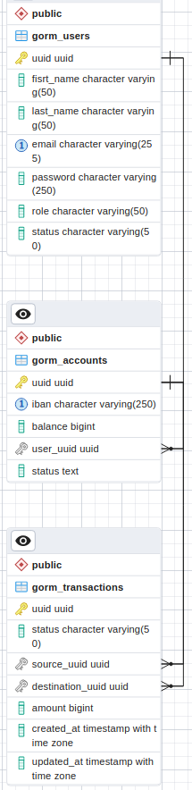

# Payments

Project "Payments"  is [final task](https://drive.google.com/file/d/1X7sKViRpL8t3XOlBElkG7pQvzpR0PjHn/view?usp=sharing) for EPAM Golang course.

## Build and run 
```
docker-compose up --build
```
## Usage
The HTTP server runs on localhost:8080

## Endpoints 
>Each method expects an body with JSON value.
### USERS

#### POST /users/register

reqiures *first_name*, *last_name*, unique *email*, *password*;
returns user's uuid;
##### example req
``` POST http://localhost:8080/users/register```
Body 
```
{   
    "firstName": "Bob",
    "lastName": "Fox",
    "email": "bob.fffox1987@gmail.com",
    "password":"qwerty"
}
```
##### res
Body
```
{
    "message": "registration success",
    "uuid": "b77499e2-ed74-4214-9fd0-86be3456843b"
}
```

#### POST /users/login

reqiures *email*, *password*;
returns authorization token;
##### example req
``` POST http://localhost:8080/users/login```
Body 
```
{  
    "email": "bob.fffox1987@gmail.com",
    "password":"qwerty"
}
```
##### res
Body
```
{
    "token": "1502fc251eec30608bd558c862cb7f03a129cff539e84f322f59ac6f1f846cb7"
}
```
>Other endpoints require the Authorization header with the token inside.
Header
```
    key:Authorization
    value:1502fc251eec30608bd558c862cb7f03a129cff539e84f322f59ac6f1f846cb7
```
### ACCOUNTS

#### POST /users/{user_uuid}/accounts/new
creates new account for user;
returns account's uuid;
##### example req
``` POST http://localhost:8080/users/b77499e2-ed74-4214-9fd0-86be3456843b/accounts/new```
##### res
Body
```
{
    "message": "new account add",
    "uuid": "b89f5687-9cd6-4275-b3d2-87fd7bd8d011"
}
```

#### GET /users/{user_uuid}/accounts

returns accounts for user; 
> URL could contain such query parameters as *offset*, *limit*, *sort_by*(expects *uuid*, *iban* or *balance*), *order*(expects *asc* or *desc*)
##### example req
``` GET http://localhost:8080/users/b77499e2-ed74-4214-9fd0-86be3456843b/accounts?sort_by=uuid&order=desc&limit=3```
##### res
Body
```
{
    "accounts": [
        {
            "uuid": "fbe8bee3-1cb7-4d90-8388-105297522a86",
            "iban": "45d0b56c4ceee91e46b64c063d7249ae867beaa2faa9bc5c965429fc88",
            "balance": 0,
            "user_uuid": "b77499e2-ed74-4214-9fd0-86be3456843b"
        },
        {
            "uuid": "f1b1dee4-a176-4cec-836f-8a4aa407efbb",
            "iban": "981024baf8ef8361b285d7e9dd86b12cc88f5143c1d209e3c9d07d8354",
            "balance": 0,
            "user_uuid": "b77499e2-ed74-4214-9fd0-86be3456843b"
        },
        {
            "uuid": "db689093-81ca-4092-bdc2-52988d5ea970",
            "iban": "1dbfc0e2df7c3edc2ea3118f0d824ecddf29cc95452b0739b05db53d3c",
            "balance": 0,
            "user_uuid": "b77499e2-ed74-4214-9fd0-86be3456843b"
        }
    ]
}
```

#### GET /users/{user_uuid}/accounts/{accounts_uuid}

returns the account; 
##### example req
``` GET http://localhost:8080/users/b77499e2-ed74-4214-9fd0-86be3456843b/accounts/db689093-81ca-4092-bdc2-52988d5ea970```
##### res
Body
```
{
    "balance": 0,
    "iban": "1dbfc0e2df7c3edc2ea3118f0d824ecddf29cc95452b0739b05db53d3c",
    "uuid": "db689093-81ca-4092-bdc2-52988d5ea970"
}
```

#### POST /users/{user_uuid}/accounts/{accounts_uuid}/add-money

requires *amount*;
adds amount to account's balance;
returns the account; 
##### example req
``` POST http://localhost:8080/users/b77499e2-ed74-4214-9fd0-86be3456843b/accounts/fbe8bee3-1cb7-4d90-8388-105297522a86/add-money```
```
{  
    "amount" : "123"
}
```
##### res
Body
```
{
    "account": {
        "uuid": "fbe8bee3-1cb7-4d90-8388-105297522a86",
        "iban": "45d0b56c4ceee91e46b64c063d7249ae867beaa2faa9bc5c965429fc88",
        "balance": 123,
        "user_uuid": "b77499e2-ed74-4214-9fd0-86be3456843b"
    },
    "message": "add money"
}
```
### TRANSACTION

#### POST /users/{user_uuid}/accounts/{accounts_uuid}/transactions/new

requires *destination_uuid*, *amount*;
creates new transaction with status "prepared";
returns transaction;
##### example req
``` POST http://localhost:8080/users/b77499e2-ed74-4214-9fd0-86be3456843b/accounts/fbe8bee3-1cb7-4d90-8388-105297522a86/transactions/new```
```
{  
    "destination_uuid" : "db689093-81ca-4092-bdc2-52988d5ea970",
    "amount": "30"
}
```
##### res
Body
```
{
    "message": "create new transaction",
    "transaction": {
        "uuid": "d8882d3c-2d44-4312-ac10-020f45ea4c43",
        "status": "prepared",
        "source_uuid": "fbe8bee3-1cb7-4d90-8388-105297522a86",
        "destination_uuid": "db689093-81ca-4092-bdc2-52988d5ea970",
        "amount": 30,
        "created_at": "2023-02-20T09:20:48.565437Z",
        "updated_at": "2023-02-20T09:20:48.565437Z"
    }
}
```

#### POST /users/{user_uuid}/accounts/{accounts_uuid}/transactions/{transaction_uuid}/send

sends the transaction, updates accounts' balances and transaction status ("sent");
returns transaction;
##### example req
``` POST http://localhost:8080/users/b77499e2-ed74-4214-9fd0-86be3456843b/accounts/fbe8bee3-1cb7-4d90-8388-105297522a86/transactions/d8882d3c-2d44-4312-ac10-020f45ea4c43/send```
##### res
Body
```
{
    "message": "sent transaction",
    "transaction": {
        "uuid": "d8882d3c-2d44-4312-ac10-020f45ea4c43",
        "status": "sent",
        "source_uuid": "fbe8bee3-1cb7-4d90-8388-105297522a86",
        "destination_uuid": "db689093-81ca-4092-bdc2-52988d5ea970",
        "amount": 30,
        "created_at": "2023-02-20T09:20:48.565437Z",
        "updated_at": "2023-02-20T09:22:15.522694Z"
    }
}
```

#### GET /users/{user_uuid}/accounts/{accounts_uuid}/transactions

returns transactions; 
> URL could contain such query parameters as *offset*, *limit*, *sort_by*(expects *uuid*, *created_at* or *updated_at*), *order*(expects *asc* or *desc*)
##### example req
``` GET http://localhost:8080/users/b77499e2-ed74-4214-9fd0-86be3456843b/accounts/fbe8bee3-1cb7-4d90-8388-105297522a86/transactions?sort_by=created_at```
##### res
Body
```
{
    "transactions": [
        {
            "uuid": "d8882d3c-2d44-4312-ac10-020f45ea4c43",
            "status": "sent",
            "source_uuid": "fbe8bee3-1cb7-4d90-8388-105297522a86",
            "destination_uuid": "db689093-81ca-4092-bdc2-52988d5ea970",
            "amount": 30,
            "created_at": "2023-02-20T09:20:48.565437Z",
            "updated_at": "2023-02-20T09:22:15.522694Z"
        },
        {
            "uuid": "fedfbd72-8daf-4a05-8684-3ac07789f0af",
            "status": "prepared",
            "source_uuid": "fbe8bee3-1cb7-4d90-8388-105297522a86",
            "destination_uuid": "db689093-81ca-4092-bdc2-52988d5ea970",
            "amount": 20,
            "created_at": "2023-02-20T09:21:40.51269Z",
            "updated_at": "2023-02-20T09:21:40.51269Z"
        },
        {
            "uuid": "a90ae2a4-eea0-42e5-b9fd-bb1ed47daaac",
            "status": "prepared",
            "source_uuid": "fbe8bee3-1cb7-4d90-8388-105297522a86",
            "destination_uuid": "db689093-81ca-4092-bdc2-52988d5ea970",
            "amount": 15,
            "created_at": "2023-02-20T09:21:49.047032Z",
            "updated_at": "2023-02-20T09:21:49.047032Z"
        }
    ]
}
```
## ERD

